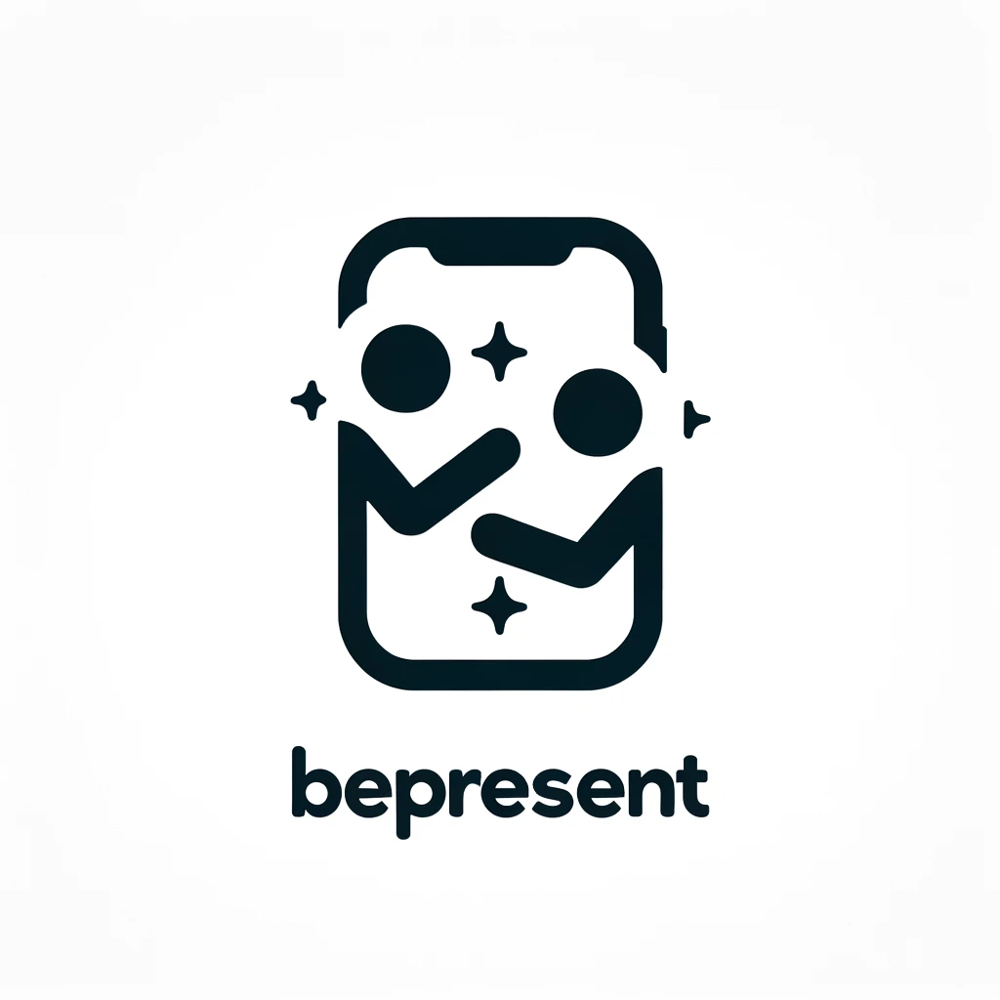

# BePresent

A full-stack mobile application to NOT use your phone while with friends. Enjoy life, Be Present.

<p align="center">
  
</p>

Disclaimer: This is not a released application, it's a demo of the app.

## Pitch

How many times have you been out with friends and everyone is on their phones? It has certainly happened to all of us, and in the end, we wish we had just stayed home watching a movie and eating snacks. The BePresent App has the solution! BePresent turns active presence in outings into a game. Create your avatar and invite your friends to a BePresent Session. Earn points as long as you don’t leave the app. Redeem your points by unlocking features to change clothes on your avatar or give it cool abilities.

## Technologies Used
This project leverages several technologies across its different components:

#### User Interface
- **Flutter**: Used for building the native user interface.
- **Dart**: The programming language used alongside Flutter.

#### Backend API
- **Python**: The core programming language for backend logic.
- **Flask**: A lightweight Python web framework used for handling API requests.

#### Database
- **MySQL**: The database system used for storing and retrieving data.

<br>
<br>
<br>

## Flutter Installation Steps

#### Windows
1. Download the Flutter SDK from the [Flutter website](https://flutter.dev/docs/get-started/install/windows).
2. Extract the zip file and place the contained flutter in the desired installation location for the Flutter SDK (e.g., `C:\src\flutter`).

#### macOS
1. Download the Flutter SDK from the [Flutter website](https://flutter.dev/docs/get-started/install/macos).
2. Extract the file and move the `flutter` folder to your desired location (e.g., `~/flutter`).

#### Linux
1. Download the Flutter SDK from the [Flutter website](https://flutter.dev/docs/get-started/install/linux).
2. Extract the file to a desired location (e.g., `~/flutter`).

Note: The above steps are a brief overview. For detailed instructions, refer to the official Flutter installation guides for [Windows](https://flutter.dev/docs/get-started/install/windows), [macOS](https://flutter.dev/docs/get-started/install/macos), and [Linux](https://flutter.dev/docs/get-started/install/linux).


## IDE Setup

For a smoother development experience, you can use an IDE like Android Studio or Visual Studio Code with the Flutter and Dart plugins installed. Refer to the Flutter documentation for [setting up an IDE](https://flutter.dev/docs/get-started/editor).

## Python Dependencies
You can view the `requirements.txt` file [here](./requirements.txt).
To install run this in your terminal:

```bash
pip install -r requirements.txt
```

## Running the app
You can run it either on a simulator or a web browser.
Source the SQL code first, in the directory SQL/, open an SQL install and run:

```MySQL
source run.sql;
```

Open a terminal and run the API with:

```bash
python -m API.main
```

Now you can run:

```bash
flutter run -d {choose your device here}
```

## Video Demo
Check out the demo of our app:

[](https://www.youtube.com/watch?v=jRZzNs71zAE "Video Title")


## Debug APK
This repo contains the Debug APK in the home directory of the repository under the name "app-debug.apk".

## Compatability
The app is compatible with both Android and iOS.

# Collaborators

<a href="https://github.com/terezann">
  
</a>
<a href="https://github.com/ntua-el15074">
  
</a>

